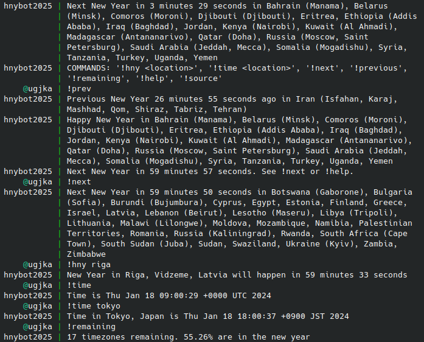

# NewYearsBot

## 2026 here we come

New Year's Eve IRC party bot

Posts New Years for each timezone when they happen

## Bot's commands

- `!next` upcoming new year
- `!previous` previous new year
- `!remaining` number of remaining timezones
- `!hny <location>` get new year status for location
- `!time <location>` get the current time in a location
- `!time` UTC
- `!help` show help

The command prefix `!` can be changed using the -prefix flag

## Pro-tip

- make sure your system's time is synchronized with NTP

## Installation

### 2026 versions coming soon

Arch linux PKGBUILD in archlinux folder

Prebuilt Linux binaries are available on the releases [page](https://github.com/ugjka/newyearsbot/releases)

### Using make

You need to have make, go, go-tools

Build with `make`

Install with `make install`

Uninstall with `make uninstall`

Clean up with `make clean`

### Specifying channel key

-channels "#channelname:channelkey, #channelname2:channelkey2"

### Yaml config file

See example config: [settings.yaml](settings.yaml)

Useful if you wanna run multiple bot instances across different IRC hosts
