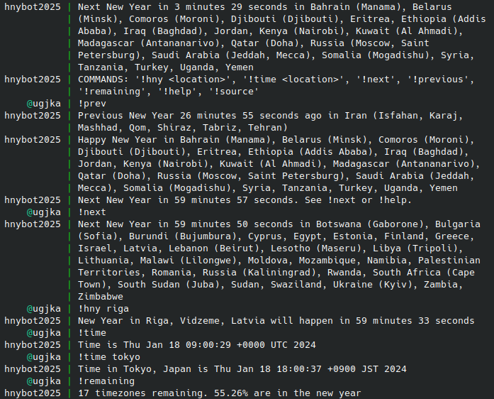

# NewYearsBot

## 2027 update

The default Nominatim server seems to now set very tight request limits probably due to AI scraping or whatever so you get "Error 429 Too many requests" pretty fast. So unless you have spare 128GB RAM and 1TB nvme to run your own Nominatim server, this project is kind of half dead

## Intro

New Year's Eve IRC party bot

Posts New Years for each timezone when they happen



## Bot's commands

- `!next` upcoming new year
- `!previous` previous new year
- `!remaining` number of remaining timezones
- `!hny <location>` get new year status for location
- `!time <location>` get the current time in a location
- `!time` UTC
- `!help` show help

The command prefix `!` can be changed using the -prefix flag

## Pro-tip

- make sure your system's time is synchronized with NTP

## Installation

### 2026 versions

Arch linux PKGBUILD in archlinux folder

Prebuilt Linux binaries are available on the releases [page](https://github.com/ugjka/newyearsbot/releases)

### Using make

You need to have make, go, go-tools

Build with `make`

Install with `make install`

Uninstall with `make uninstall`

Clean up with `make clean`

## Usage

```
[ugjka@ugjka-pc newyearsbot]$ ./newyearsbot -h

New Year's Eve IRC party bot
Announces new years as they happen in each timezone

CMD Options:
[mandatory]
-channels       comma separated list of channels eg. "#test, #test2"
                channel key can be specifed after ":" e.g #channelname:channelkey
-nick           irc nick
-email          nominatim email

[optional]
-password       irc server password
-saslnick       sasl username
-saslpass       sasl password
-server         irc server (default: irc.libera.chat:6697)
-prefix         command prefix (default: !)
-nossl          disable ssl for irc
-nocheck	    disable ssl verification (e.g. self signed ssl)
-nominatim      nominatim server (default: http://nominatim.openstreetmap.org)
-nolimit        disable flood kick protection
-colors         enable irc colors
-bind           bind to host address
-debug          debug irc traffic
-yaml           yaml config file
```

### Specifying channel key

-channels "#channelname:channelkey, #channelname2:channelkey2"

### Yaml config file

See example config: [settings.yaml](settings.yaml)

Useful if you wanna run multiple bot instances across different IRC hosts
